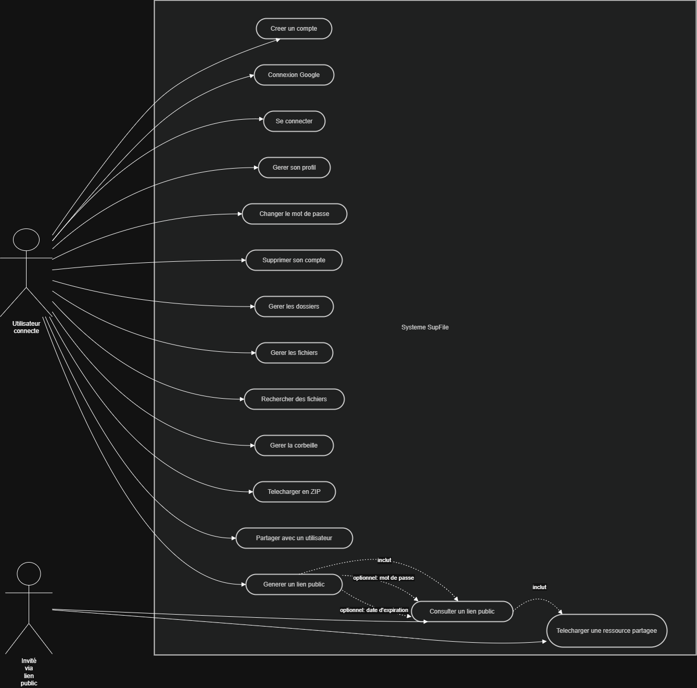
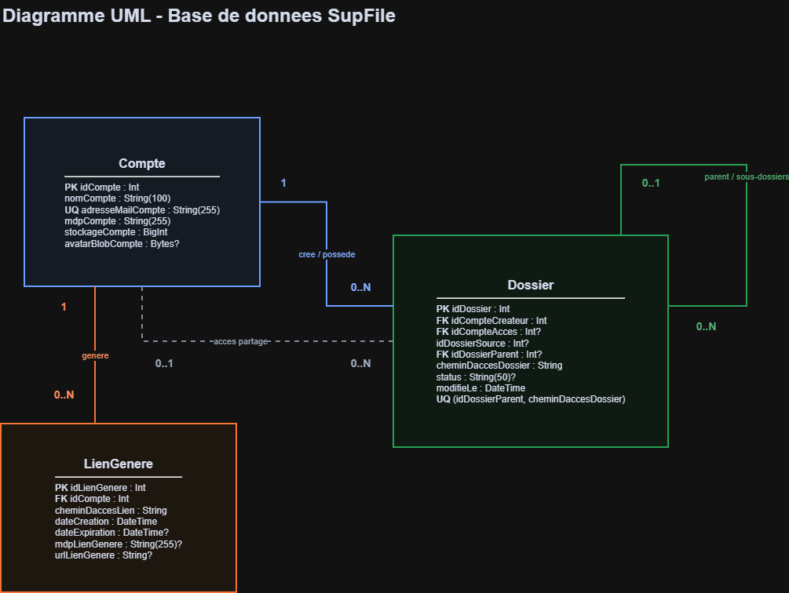

# SupFile
SupFile est une application de gestion, stockage et partage de fichiers développée dans le cadre du projet de fin de 4e année à SUPINFO Tours.

Le projet propose une plateforme complète avec une application web, une API REST, une base PostgreSQL et une application mobile Expo. Les utilisateurs peuvent créer un compte, organiser leurs fichiers par dossiers, téléverser des documents, gérer leurs dossiers & fichiers, partager des dossiers avec d'autres utilisateurs et générer des liens publics protégés.

## Équipe projet
- Cyprien Fournier
- Alex Gontier
- Jeremy Yang
- Killian Moreau
- Alexandre Chuzel-Marmot

## Dépôt Git publique
Le dépôtt Git est accessible publiquement sur https://github.com/jejeYang/4PROJ-Dev.git 

## Sommaire
- [Fonctionnalités](#fonctionnalités)
- [Diagramme de cas d'utilisation](#diagramme-de-cas-dutilisation)
- [Architecture](#architecture)
- [Technologies](#technologies)
- [Prérequis](#prérequis)
- [Démarrage rapide avec Docker](#démarrage-rapide-avec-docker)
- [Installation locale](#installation-locale)
- [Variables d'environnement](#variables-denvironnement)
- [Documentation API Swagger](#documentation-api-swagger)
- [Manuel utilisateur](#manuel-utilisateur)
- [Structure du projet](#structure-du-projet)
- [Scripts utiles](#scripts-utiles)
- [Base de données](#base-de-données)
- [Comptes de démonstration](#comptes-de-démonstration)
- [Notes de développement](#notes-de-développement)

## Fonctionnalités

- Authentification par email et mot de passe.
- Authentification Google OAuth.
- Création, modification et suppression de compte.
- Création, renommage, déplacement et suppression de dossiers.
- Renommage, déplacement et suppression de fichiers.
- Téléversement simple et multiple de fichiers.
- Visualisation rapide de fichiers.
- Téléchargement d'éelements au format ZIP, déplacement d'elements et suppression d'elements, via selection multiple.
- Recherche, filtres et tri.
- Gestion d'une corbeille avec restauration ou suppression définitive.
- Partage interne de dossiers entre utilisateurs.
- Génération de liens publics de partage avec mot de passe & date d'expiration.
- Documentation API interactive avec Swagger UI.
- Interface web responsive.
- Application mobile Expo.

## Diagramme de cas d'utilisation


## Architecture
Le projet est organisé en trois applications principales :

- `back` : API REST Express, Prisma, PostgreSQL, gestion des fichiers et documentation Swagger.
- `front` : application web React avec Vite.
- `mobile` : application mobile Expo / React Native.

Les services Docker lancent :

- PostgreSQL sur `localhost:5432`.
- API backend sur `localhost:3000`.
- Frontend web sur `localhost:5173`.

## Technologies

### Backend
- Node.js
- Express
- Prisma ORM
- PostgreSQL
- JSON Web Token
- Bcrypt
- Multer
- Archiver
- Node-cron
- Swagger UI Express

### Frontend web
- React
- Vite
- React Router
- Axios
- Lucide React
- PrimeReact
- Recharts

### Mobile
- Expo
- React Native
- TypeScript
- Axios
- React Navigation
- Expo Document Picker
- Expo Image Picker
- Expo File System

### Infrastructure
- Docker
- Docker Compose
- PostgreSQL 16 Alpine

## Prérequis
Pour lancer le projet avec Docker :
- Docker
- Docker Compose

Pour un lancement local sans Docker :
- Node.js 22 recommandé
- npm
- PostgreSQL
- Expo Go version 54 pour l'application mobile sur téléphone

## Démarrage rapide avec Docker
Depuis la racine du projet, créer d'abord le fichier `.env` local à partir du modèle :

```powershell
Copy-Item .env.example .env
```

Renseigner au minimum `POSTGRES_PASSWORD` et `JWT_SECRET`, puis lancer :

```bash
docker compose up --build
```

Cette commande construit et démarre les services suivants :

- API : [http://localhost:3000](http://localhost:3000)
- Swagger : [http://localhost:3000/api-docs](http://localhost:3000/api-docs)
- Frontend : [http://localhost:5173](http://localhost:5173)
- PostgreSQL : `localhost:5432`

Pour arrêter les conteneurs :

```bash
docker compose down
```

## Installation locale
### Installer les prérequis du mobile
- Installer Expo Go version 54 sur son mobile (https://expo.dev/)
- Connecter par USB son mobile à son ordinateur, avec autorisation de transfert de fichier.
- Avoir son mobile et son ordinateur sur le même réseau
- Mettre l'ip de votre ordi dans l'ip de mobile/src/config.ts 

### Lancer l'application mobile
```bash
cd mobile
npm install
npm start
```
Sur Expo Go, utiliser le lien ex://192.168.x.x:8081, ou scanner le QR code

## Variables d'environnement

### Backend

| Variable | Description | Valeur par défaut |
| --- | --- | --- |
| `PORT` | Port d'écoute de l'API | `3000` |
| `DATABASE_URL` | URL de connexion PostgreSQL utilisée par Prisma | Requise hors Docker |
| `FILES_PATH` | Chemin de stockage physique des fichiers | `back/storage/files` |
| `JWT_SECRET` | Secret de signature des tokens JWT | Requis |
| `GOOGLE_CLIENT_ID` | Client ID OAuth 2.0 Google | Optionnel |
| `PG_HOST` | Hôte PostgreSQL utilisé par la config interne | `localhost` |
| `PG_PORT` | Port PostgreSQL | `5432` |
| `PG_DATABASE` | Nom de la base | `supfile` |
| `PG_USER` | Utilisateur PostgreSQL | `postgres` |
| `PG_PASSWORD` | Mot de passe PostgreSQL | Aucun |

Exemple PowerShell :

```powershell
$env:DATABASE_URL = "postgresql://postgres:<mot_de_passe>@localhost:5432/supfile"
$env:GOOGLE_CLIENT_ID = "votre-client-id.apps.googleusercontent.com"
$env:JWT_SECRET = "<secret_jwt_long_et_aleatoire>"
```

### Frontend

| Variable | Description |
| --- | --- |
| `VITE_GOOGLE_CLIENT_ID` | Client ID OAuth Google utilisé par l'application web |

Exemple PowerShell :

```powershell
$env:VITE_GOOGLE_CLIENT_ID = "votre-client-id.apps.googleusercontent.com"
npm run dev
```

### Mobile

| Variable | Description |
| --- | --- |
| `EXPO_PUBLIC_GOOGLE_CLIENT_ID` | Client ID OAuth Google utilisé par le mobile |
| `EXPO_PUBLIC_GOOGLE_ANDROID_ID` | Client ID OAuth Google utilisé par Android |
| `EXPO_PUBLIC_GOOGLE_IOS_ID` | Client ID OAuth Google utilisé par IOS |

L'application mobile utilise l'URL déclarée dans :

```text
mobile/src/config.ts
```

Remplacer `API_BASE_URL` par l'adresse IP locale de la machine qui exécute le backend :

```ts
export const API_BASE_URL = 'http://192.168.x.x:3000';
```

Le téléphone et l'ordinateur doivent être connectés au même réseau.

## Documentation API Swagger
Une documentation est disponible côté backend :

- Interface Swagger UI : [http://localhost:3000/api-docs](http://localhost:3000/api-docs)

La documentation couvre notamment :

- Authentification
- Gestion des utilisateurs
- Dossiers
- Fichiers
- Corbeille
- Partages internes
- Liens publics

Les routes protégées utilisent un token JWT au format :

```http
Authorization: Bearer <token>
```

Les liens publics protégés peuvent recevoir le mot de passe via :

```http
x-lien-password: <mot-de-passe>
```

ou via le paramètre de requête `password`.

## Manuel utilisateur
Un manuel de prise en main de l'interface web est disponible ici :

[Consulter le manuel utilisateur au format Google Docs](docs/manuel-utilisateur-google-docs.docx)

## Structure du projet

```text
.
├── back
│   ├── prisma
│   │   ├── migrations
│   │   ├── schema.prisma
│   │   └── seed.js
│   ├── src
│   │   ├── config
│   │   ├── controllers
│   │   ├── docs
│   │   ├── dto
│   │   ├── jobs
│   │   ├── metier
│   │   ├── middlewares
│   │   ├── repositories
│   │   ├── routes
│   │   ├── services
│   │   └── utils
│   ├── Dockerfile
│   └── server.js
├── front
│   ├── public
│   ├── src
│   │   ├── assets
│   │   ├── components
│   │   ├── context
│   │   ├── hooks
│   │   ├── pages
│   │   ├── styles
│   │   └── utils
│   ├── Dockerfile
│   └── vite.config.js
├── mobile
│   ├── src
│   │   ├── api
│   │   ├── assets
│   │   ├── components
│   │   ├── config.ts
│   │   ├── context
│   │   ├── hooks
│   │   ├── navigation
│   │   └── screens
│   │   └── styles
│   │   └── types
│   │   └── utils
│   └── App.tsx
├── docs
│   ├── Diagramme_de_cas_dutilisation.png
│   ├── diagramme-uml-base-donnees.drawio
|   ├── diagramme-uml-base-donnees.drawio.png
│   └── manuel-utilisateur-google-docs.docx
├── docker-compose.yml
└── README.md
```

## Scripts utiles

### Backend

```bash
cd back
npm start
npm run prisma:generate
npm run prisma:migrate
npm run prisma:seed
```

### Frontend

```bash
cd front
npm run dev
npm run build
npm run lint
npm run preview
```

### Mobile

```bash
cd mobile
npm start
npm run android
npm run ios
npm run web
```

## Base de données

Le backend utilise Prisma avec PostgreSQL.

Le diagramme UML de la base est disponible au format png :

[Ouvrir le diagramme UML de la base de données](docs/diagramme-uml-base-donnees.drawio.png)


Les modèles principaux sont :

- `Compte` : utilisateurs, email, mot de passe hashé, stockage et avatar.
- `Dossier` : arborescence de dossiers, propriétaire, partage interne et corbeille.
- `LienGenere` : liens publics, expiration, mot de passe optionnel et token public.

Avec Docker, les migrations Prisma et le seed sont exécutés automatiquement au démarrage du conteneur backend.

Sans Docker, exécuter :

```bash
cd back
npm run prisma:migrate
npm run prisma:seed
```

## Comptes de démonstration
Le seed crée des comptes de test :

| Email | Rôle |
| --- | --- |
| `admin@supfile.com` | Administrateur de démonstration |
| `user@test.com` | Utilisateur de démonstration |

Les mots de passe sont hashés dans le seed. Si besoin, les modifier directement dans `back/prisma/seed.js` puis relancer :

```bash
cd back
npm run prisma:seed
```

## Notes de développement
- Les fichiers utilisateurs sont stockés physiquement dans `back/storage/files` en local.
- En Docker, ce dossier est monté dans le conteneur backend sur `/app/files`.
- La corbeille repose sur un dossier spécial `.corbeille`.
- Un job planifié supprime les liens publics expirés chaque nuit.

## Licence
Projet académique réalisé à SUPINFO Tours.
